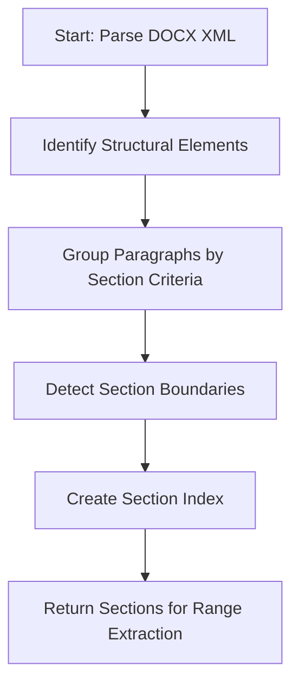

# DOCX Parser Architectural Changes: Paragraphs to Logical Sections/Blocks

## Overview
This document outlines the architectural changes required to update the DOCX parser's range unit from paragraphs to logical sections/blocks while preserving all existing functionality.

## Current State Analysis

### Current Implementation
- The DOCX parser currently uses paragraphs as the range unit
- `GetRangeUnit()` returns "sections" (though the implementation treats them as paragraphs)
- `ParseRange()` extracts text based on paragraph indices
- The parser preserves:
  - Full DOCX extraction
  - Table extraction with Markdown representation
  - Unicode support
  - Nested table-cell paragraphs
  - Error handling

### Key Components
1. `parsers/docx/parser.go` - Main parser implementation
2. `internal/parser/range_unit.go` - Range unit definitions
3. `internal/parser/range_parser.go` - Range parsing logic
4. `cmd/clip/main.go` - CLI integration

## Proposed Changes

### 1. Logical Section Detection Algorithm

#### New Algorithm Design


#### Implementation Approach
- Modify `extractStructuredContentFromXML()` to detect logical sections
- Add section boundary detection based on:
  - Heading styles (h1, h2, h3, etc.)
  - Page breaks
  - Section breaks in DOCX XML
  - Significant whitespace/format changes
- Create a section index mapping paragraphs to sections

#### Key Changes
```go
// New section detection in extractStructuredContentFromXML
type Section struct {
    ID         int
    Paragraphs []StructuredParagraph
    StartIndex int
    EndIndex   int
}

func detectSections(paragraphs []StructuredParagraph) []Section {
    var sections []Section
    currentSection := Section{ID: 1, Paragraphs: []StructuredParagraph{}}
    
    for i, para := range paragraphs {
        // Detect section boundaries based on heading styles, breaks, etc.
        if isSectionBoundary(para) {
            if len(currentSection.Paragraphs) > 0 {
                currentSection.EndIndex = i - 1
                sections = append(sections, currentSection)
                currentSection = Section{ID: len(sections) + 1, StartIndex: i}
            }
        }
        currentSection.Paragraphs = append(currentSection.Paragraphs, para)
    }
    
    if len(currentSection.Paragraphs) > 0 {
        sections = append(sections, currentSection)
    }
    
    return sections
}
```

### 2. Parser Interface Changes

#### Preserve Existing Interface
- No changes to the `Parser` interface
- Maintain backward compatibility with existing code

#### Internal Modifications
```go
// Update ParseRange to work with sections instead of paragraphs
func (p *Parser) ParseRange(ctx context.Context, req parser.ParseRequest, start, end int) (parser.ParseResult, error) {
    // 1. Extract structured content with sections
    sections, err := extractSectionsFromXML(documentXML)
    if err != nil {
        return parser.ParseResult{}, wrapError("failed to parse DOCX sections", err)
    }
    
    // 2. Validate section range
    totalSections := len(sections)
    if start > totalSections || end > totalSections {
        return parser.ParseResult{}, wrapError(fmt.Sprintf("requested section range exceeds document section count"), nil)
    }
    
    // 3. Extract requested sections
    var result strings.Builder
    for i := start - 1; i < end && i < len(sections); i++ {
        if i > start-1 {
            result.WriteString("\n\n") // Double newline between sections
        }
        // Extract section content
        sectionContent := extractSectionContent(sections[i])
        result.WriteString(sectionContent)
    }
    
    return parser.ParseResult{Text: result.String()}, nil
}
```

### 3. Range Extraction Logic Modifications

#### Current Logic
- Works with paragraph indices
- Simple linear extraction

#### New Logic
- Works with section indices
- Preserves section structure
- Handles nested content within sections

```go
func extractSectionContent(section Section) string {
    var content strings.Builder
    
    for i, para := range section.Paragraphs {
        if i > 0 {
            if para.IsTable {
                if content.Len() > 0 {
                    content.WriteString("\n")
                }
            } else {
                content.WriteString("\n")
            }
        }
        content.WriteString(para.Content)
    }
    
    return content.String()
}
```

### 4. GetRangeUnit() and CLI Integration

#### Update GetRangeUnit()
```go
func (p *Parser) GetRangeUnit() string {
    return "sections" // Now accurately reflects logical sections
}
```

#### CLI Updates
- Update help text to reflect "sections" instead of "blocks"
- Ensure range validation works with section counts
- Preserve all existing CLI functionality

```go
// In cmd/clip/main.go, update help text:
fmt.Println("  DOCX      -> sections")
```

### 5. Test Requirements

#### Test Coverage Areas
1. **Section Detection Tests**
   - Test heading-based section detection
   - Test page break detection
   - Test nested content handling

2. **Range Extraction Tests**
   - Test single section extraction
   - Test multi-section ranges
   - Test edge cases (start/end of document)

3. **Backward Compatibility Tests**
   - Verify existing functionality still works
   - Test table extraction
   - Test Unicode support
   - Test error handling

4. **Integration Tests**
   - CLI integration tests
   - Range validation tests
   - File handling tests

#### Example Test Cases
```go
func TestSectionDetection(t *testing.T) {
    // Test with document containing headings
    sections := detectSections(testParagraphsWithHeadings)
    assert.Equal(t, 3, len(sections), "Should detect 3 sections from headings")
}

func TestSectionRangeExtraction(t *testing.T) {
    // Test extracting sections 1-2 from test document
    result, err := parser.ParseRange(context.Background(), testReq, 1, 2)
    assert.NoError(t, err)
    assert.Contains(t, result.Text, "Section 1 Content")
    assert.Contains(t, result.Text, "Section 2 Content")
    assert.NotContains(t, result.Text, "Section 3 Content")
}
```

## Implementation Plan

### Phase 1: Algorithm Development
1. Implement section detection algorithm
2. Create test cases for section detection
3. Verify algorithm handles edge cases

### Phase 2: Parser Updates
1. Modify `ParseRange()` to use sections
2. Update internal helper functions
3. Ensure table extraction still works

### Phase 3: Integration
1. Update CLI help text
2. Test CLI integration
3. Verify backward compatibility

### Phase 4: Testing
1. Run existing test suite
2. Add new section-specific tests
3. Perform manual testing with real documents

## Risk Assessment

### Low Risk Areas
- Parser interface (no changes required)
- CLI integration (minimal changes)
- Error handling (preserved)

### Medium Risk Areas
- Section detection algorithm (complex logic)
- Range extraction modifications (core functionality)

### Mitigation Strategies
- Comprehensive unit testing
- Gradual rollout with feature flags
- Extensive manual testing with diverse documents

## Conclusion

This design proposes the smallest clean architectural change to implement logical section detection while preserving all existing functionality. The changes are focused on the internal parsing logic with minimal impact on the external interface and CLI integration.